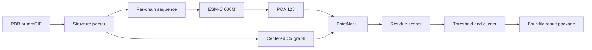

# ProtCross

[](https://pypi.org/project/protcross/)
[](https://github.com/GeraltZeroZhong/ProtCross/releases)
[](https://github.com/GeraltZeroZhong/ProtCross/releases)
[](#version-history)
[](https://www.python.org/)
[](LICENSE)
[](https://doi.org/10.1021/acs.jcim.5c03224)

**Install:** [PyPI / CLI](https://pypi.org/project/protcross/) ·
[Windows x64 Desktop](https://github.com/GeraltZeroZhong/ProtCross/releases) ·
[macOS Apple Silicon Desktop](https://github.com/GeraltZeroZhong/ProtCross/releases)

ProtCross is a protein binding-site prediction tool for experimental and
predicted PDB/mmCIF structures, including AlphaFold models. It converts protein
coordinates into residue-level binding-site scores, ranked spatial clusters,
centroids, annotated structures, and provenance for structure triage, receptor
preparation, docking setup, and experimental prioritization. The method is
described in [*ProtCross: Bridging the PDB-AlphaFold Gap for Binding Site
Prediction with Protein Point Clouds*](https://doi.org/10.1021/acs.jcim.5c03224),
published in the *Journal of Chemical Information and Modeling*.

Predicted structures have expanded structural coverage, yet a single
unrefined model often requires site-centred assessment before downstream
atomistic modelling. Global fold accuracy and pLDDT alone do not establish a
ligand-compatible pocket: local side chains, loops, conformational state,
cofactors, ions, waters, and biological assembly can materially alter docking
poses and virtual-screening enrichment
([Holcomb et al., 2023](https://doi.org/10.1002/pro.4530);
[Karelina et al., 2023](https://doi.org/10.7554/eLife.89386);
[Lyu et al., 2024](https://doi.org/10.1126/science.adn6354)).

## Quick start

ProtCross 0.2.2 uses Python 3.10:

Review the [ESM-C model terms](https://www.evolutionaryscale.ai/policies/cambrian-non-commercial-license-agreement)
before asset setup. A fresh setup downloads approximately 2.14 GiB of model
weights; subsequent predictions reuse the local asset cache.

```bash
python3.10 -m venv .venv
source .venv/bin/activate
python -m pip install --upgrade pip
python -m pip install "protcross[predict]"

protcross setup-assets --accept-esm-license
protcross inspect input.pdb
protcross predict input.pdb --out-dir protcross-results
```

The prediction command creates:

```text
protcross-results/
├── input.protcross.pdb
├── input.protcross.scores.tsv
├── input.protcross.pockets.json
└── input.protcross.summary.json
```

Windows x64 and macOS Apple Silicon Desktop builds are available through
[GitHub Releases](https://github.com/GeraltZeroZhong/ProtCross/releases). The
Desktop workflow installs its local runtime, manages assets, inspects inputs,
runs single or batch predictions, and displays results with Mol*.

## Contents

- [Quick start](#quick-start)
- [Highlights](#highlights)
- [Installation](#installation)
- [Run predictions](#run-predictions)
- [Output package](#output-package)
- [Model and inference pipeline](#model-and-inference-pipeline)
- [Batch inference](#batch-inference)
- [Python API](#python-api)
- [Assets](#assets)
- [Desktop application](#desktop-application)
- [Training and development](#training-and-development)
- [Troubleshooting](#troubleshooting)
- [Version history](#version-history)
- [Citation](#citation)
- [License](#license)

## Highlights

- PDB, mmCIF, and AlphaFold coordinate input
- Per-chain ESM-C 600M embeddings with paired 128-dimensional PCA features
- PointNet++ residue segmentation over centered Cα point clouds
- PDB/mmCIF annotation, extended TSV, cluster JSON, and provenance JSON
- CPU, CUDA, and Apple MPS device selection
- Bounded ESM-C and PointNet++ microbatching for high-throughput inference
- Deterministic pure-PyTorch FPS, radius, and KNN geometry operators
- Local Desktop, unified CLI, and reusable Python API

## Installation

### Requirements

| Workflow | Requirements |
| --- | --- |
| CLI and Python inference | Python 3.10, PyTorch 2.3, local runtime assets |
| Desktop inference | Windows 10/11 x64 or macOS 12+ Apple Silicon |
| Training | Python 3.10, Conda, CUDA recommended |
| Desktop development | Node.js 20, Rust 1.88, Tauri 2 system packages |

ProtCross declares `python >=3.10,<3.11`. Create a dedicated Python 3.10
environment for installation. The platform commands below install the PyPI
distribution.

### Linux CPU

```bash
python3.10 -m venv .venv
source .venv/bin/activate
python -m pip install --upgrade pip
python -m pip install \
  torch==2.3.1+cpu torchvision==0.18.1+cpu \
  --index-url https://download.pytorch.org/whl/cpu
python -m pip install "protcross[predict]"
protcross --version
```

### Linux CUDA 12.1

Install the CUDA wheel matching the PyTorch 2.3 runtime, then install ProtCross:

```bash
python3.10 -m venv .venv
source .venv/bin/activate
python -m pip install --upgrade pip
python -m pip install \
  torch==2.3.1+cu121 torchvision==0.18.1+cu121 \
  --index-url https://download.pytorch.org/whl/cu121
python -m pip install "protcross[predict]"
python -c "import torch; print(torch.cuda.is_available(), torch.version.cuda)"
```

Use the [PyTorch installation selector](https://pytorch.org/get-started/locally/)
when the host driver requires another PyTorch 2.3 wheel.

### macOS Apple Silicon

```bash
python3.10 -m venv .venv
source .venv/bin/activate
python -m pip install --upgrade pip
python -m pip install "protcross[predict]"
protcross --version
```

PyTorch supplies Apple Silicon wheels through the Python package index.

### Windows PowerShell

```powershell
py -3.10 -m venv .venv
.\.venv\Scripts\python.exe -m pip install --upgrade pip
.\.venv\Scripts\python.exe -m pip install `
  torch==2.3.1+cpu torchvision==0.18.1+cpu `
  --index-url https://download.pytorch.org/whl/cpu
.\.venv\Scripts\python.exe -m pip install "protcross[predict]"
.\.venv\Scripts\protcross.exe --version
```

Activate the environment to use the shorter commands shown throughout this
README.

### Development environment

```bash
conda env create -f environment.yml
conda activate protcross
python -m pip install -e ".[dev,esm]"
```

## Run predictions

### Inspect a structure

`protcross inspect` parses coordinate metadata without loading model assets.
The repository includes [`examples/6fhu.pdb`](examples/6fhu.pdb) for a first
run.

```bash
protcross inspect input.cif
protcross inspect input.cif --chain A
protcross inspect input.cif --json
```

The report includes coordinate models, chains, scorable residues, missing Cα
atoms, modified residues, alternate conformers, coordinate breaks, numbering
gaps, and ESM-C context length.

```text
Input: examples/6fhu.pdb
Format: PDB
Models: 1
Chains: A
Scorable residues: 52
Longest chain context: 52 / 1022
Ready for prediction.
```

### Predict one structure

```bash
protcross predict input.pdb \
  --out-dir results \
  --device cpu \
  --threshold 0.5 \
  --pocket-cluster-cutoff 8.0
```

Common options:

| Option | Default | Function |
| --- | ---: | --- |
| `--chain ID` | all chains | Select one author chain ID |
| `--device` | `cpu` | Select `cpu`, `cuda`, `cuda:N`, `mps`, or `auto` |
| `--threshold` | `0.5` | Set the strict residue selection threshold |
| `--pocket-cluster-cutoff` | `8.0` | Set the Cα graph cutoff in Å |
| `--max-len` | `1022` | Set the per-chain ESM-C residue limit |
| `--allow-truncation` | disabled | Keep the leading `max_len` residues of each long chain |
| `--embedding-cache-dir` | unset | Cache reduced ESM/PCA residue features |
| `--overwrite` | disabled | Replace an existing result package |
| `--offline` | disabled | Restrict asset resolution to local files |

Use explicit paths when integrating ProtCross into a workflow:

```bash
protcross predict input.cif \
  --chain A \
  --output results/input.protcross.cif \
  --scores-tsv results/input.protcross.scores.tsv \
  --pocket-json results/input.protcross.pockets.json \
  --summary-json results/input.protcross.summary.json
```

### Structure handling

| Input property | Processing rule |
| --- | --- |
| File format | `.pdb`, `.cif`, or `.mmcif` |
| Coordinate model | First model |
| Assembly | Coordinates supplied in the input file |
| Scorable residue | Standard polymer amino acid with a Cα atom |
| Geometry | One centered Cα point cloud across selected chains |
| Sequence context | Coordinate-observed sequence, embedded independently per chain |
| Chain selection | All scorable chains or one `--chain` value |
| Maximum context | 1,022 scorable residues per chain |
| Canonical order | Model, author chain, label/auth sequence position, insertion code |
| Alternate Cα | Bio.PDB-selected conformer |
| Modified residue | Omitted from geometry and sequence context |
| Coordinate break | Observed residues remain in the same per-chain ESM-C sequence |

The parser retains author and label identifiers from mmCIF, insertion codes,
residue names, input B-factors, raw Cα coordinates, and the source-file hash.

### Command reference

| Command | Purpose |
| --- | --- |
| `protcross inspect` | Validate and summarize a coordinate file |
| `protcross predict` | Run single-structure inference |
| `protcross setup-assets` | Install and verify runtime assets |
| `protcross preprocess` | Convert structures into training tensors |
| `protcross download-af2` | Download matched AlphaFold structures |
| `protcross map-labels` | Transfer PDB-derived labels to AF2 samples |
| `protcross train` | Launch the Hydra/Lightning training workflow |

```bash
protcross --help
protcross COMMAND --help
```

## Output package

### Files

| File | Contents |
| --- | --- |
| `input.protcross.pdb` or `.cif` | Input structure with residue scores in B-factor fields |
| `input.protcross.scores.tsv` | Residue identifiers, scores, calls, coordinates, cluster IDs, and ranks |
| `input.protcross.pockets.json` | Thresholded residue clusters and spatial statistics |
| `input.protcross.summary.json` | Parameters, assets, runtime, hashes, warnings, and top-ranked results |

PDB annotation preserves record order and updates B-factor columns on
`ATOM`/`HETATM` records. mmCIF annotation retains coordinate categories and
serializes an updated document. PDB B-factor values use two decimal places;
TSV and JSON retain full numeric precision. The default
`--unscored-bfactor-policy zero` assigns `0.0` to unscored atoms in the scored
model. The `keep` policy retains input values for unscored atoms. Additional
coordinate models retain their original values.

### Scores and clusters

| Stage | Definition |
| --- | --- |
| Residue score | `softmax(logits, dim=1)[:, 1]` |
| Binary call | `score > threshold` |
| Cluster graph | Selected Cα pairs with distance `<= cluster_cutoff` |
| Components | Single-linkage connected components, including singletons |
| Cluster order | Descending count/mean/maximum, then ascending canonical index |
| Cluster center | Score-weighted Cα centroid |

`model_score` is the canonical TSV field. `probability` remains available as a
schema compatibility alias. Higher values indicate stronger support from the
model's binding-site class; residue ranks preserve the continuous ordering.
The threshold creates binary calls and cluster membership. Empty selections
produce zero clusters and null aggregate/top-cluster entries.
Selected chains share one geometry graph, so connected components can span a
chain interface.

### Schemas

- `protcross-pocket-v2` for `pockets.json`
- `protcross-summary-v2` for `summary.json`
- extended TSV columns for PDB and mmCIF residue identifiers

The JSON package records the application version, scoring procedure, selected
asset bundle, asset hashes, input SHA256, threshold, clustering parameters,
device, precision, and effective microbatch size.

## Model and inference pipeline



### Components

| Component | Configuration |
| --- | --- |
| ESM-C | 600M, hidden size 1,152, 36 layers, 18 attention heads |
| PCA | Paired reducer, 128 output dimensions |
| Set abstraction 1 | Sampling ratio `0.5`, radius `10 Å`, 64 neighbors |
| Set abstraction 2 | Sampling ratio `0.25`, radius `20 Å`, 64 neighbors |
| Set abstraction 3 | Sampling ratio `0.1`, radius `40 Å`, 64 neighbors |
| Feature propagation | Three `k=3` interpolation stages |
| Segmentation head | `128 -> 64 -> 32 -> 2`, dropout `0.5` |

The inference parser creates centered Cα geometry and per-chain sequence
chunks. ESM-C embeddings are reduced with the PCA asset paired to the selected
checkpoint. PointNet++ processes every input structure as an independent graph
and returns one two-class logit vector per residue.

The geometry backend uses pure-PyTorch farthest-point sampling, radius search,
and stable KNN interpolation. Radius neighborhoods retain the first 64 source
neighbors in canonical input order. Inference runs in FP32 and records the
execution mode in `summary.json`. Canonical ordering and neighbor selection are
deterministic; floating-point reductions remain device- and kernel-dependent.

### Training architecture

ProtCross uses a source-domain residue segmentation objective and adversarial
domain adaptation between PDB and matched AF2 structures. The target-domain
adversarial term supports pLDDT weighting. The maintained model configuration
uses `feature_dim=128`, `use_esm=true`, `use_da=true`, and `da_weight=0.2`.

Training labels are generated from standard-residue Cα atoms within `6 Å` of
eligible hetero-residue atoms. The parser applies a versioned residue-name
filter for waters, common crystallization additives, salts, ions, and terminal
caps.

## Batch inference

ProtCross 0.2.2 batches ESM-C feature extraction and PointNet++ graph inference
and preserves input order and per-structure outputs.

```python
from pathlib import Path

from protcross.inference import ProtCrossPredictor

inputs = sorted(Path("structures").glob("*.pdb"))
output_dir = Path("batch-results")
output_dir.mkdir(parents=True, exist_ok=True)

predictor = ProtCrossPredictor.from_default_assets(
    device="cuda",
    embedding_cache_dir=".protcross-feature-cache",
    accept_esm_license=True,
)

output_paths = [
    {
        "output_pdb": output_dir / f"{path.stem}.protcross{path.suffix}",
        "scores_tsv": output_dir / f"{path.stem}.protcross.scores.tsv",
        "pocket_json": output_dir / f"{path.stem}.protcross.pockets.json",
        "summary_json": output_dir / f"{path.stem}.protcross.summary.json",
    }
    for path in inputs
]

results = predictor.predict_many(
    inputs,
    output_paths=output_paths,
    batch_size=4,
    max_batch_residues=4096,
    max_batch_quadratic_cost=4 * 1022**2,
)
```

### Scheduler controls

| Parameter | Default | Budget |
| --- | ---: | --- |
| `batch_size` | `4` | Maximum PointNet++ graphs per microbatch |
| `max_batch_residues` | `4096` | Maximum total graph nodes |
| `max_batch_quadratic_cost` | `4 * 1022**2` | Maximum `sum(n_i**2)` geometry cost |
| `feature_batch_size` | CPU: `min(batch_size, 2)`; accelerator: `batch_size` | Maximum ESM-C sequences per microbatch |
| `max_feature_padded_tokens` | `2048` | Maximum padded ESM-C token matrix |
| `return_exceptions` | `False` | Per-item exception collection |

The scheduler keeps each structure in one PointNet++ graph and each chain in one
ESM-C context. Identical chain sequences share one feature extraction
within a microbatch. The feature cache validates tensor shape, PCA dimension,
finite values, cache schema, and ESM/PCA asset identity.

The residue and quadratic-cost limits are hard bounds for both a microbatch and
each individual structure. An input graph that exceeds either limit fails before
feature extraction; select a chain or raise the corresponding explicit limit.

Accelerator memory errors trigger recursive microbatch splitting. With
`return_exceptions=True`, failed items occupy their original list positions as
exception objects. Completed items retain `PredictionResult` values.
Desktop batch jobs use the same predictor API with a microbatch size of four.
When a single-structure microbatch exhausts device memory, the item returns or
raises that exception according to `return_exceptions`; chain selection and a
smaller structure scope reduce its graph size.

Cache keys include the chain sequence, cache schema, PCA dimension, maximum
context, asset version, and ESM/PCA asset identity. Cache writes use atomic
temporary-file replacement. Remove the cache directory to reclaim space or
force feature regeneration. Predictors constructed with an injected ESM
extractor or PCA reducer require a non-empty `feature_pipeline_fingerprint`
before persistent feature caching can be enabled.

The batch return type is `list[PredictionResult]` with the default exception
mode and `list[PredictionResult | Exception]` with `return_exceptions=True`.
Each `output_paths` mapping accepts `output_pdb`, `scores_tsv`, `pocket_json`,
and `summary_json`; the result-schema aliases `structure` and `pockets_json`
are accepted as well.

## Python API

### Single-structure helper

```python
from pathlib import Path

from protcross.inference import predict_pdb

output_dir = Path("results")
output_dir.mkdir(parents=True, exist_ok=True)

result = predict_pdb(
    "examples/6fhu.pdb",
    device="cpu",
    accept_esm_license=True,
    output_pdb="results/6fhu.protcross.pdb",
    scores_tsv="results/6fhu.protcross.scores.tsv",
    pocket_json="results/6fhu.protcross.pockets.json",
    summary_json="results/6fhu.protcross.summary.json",
)

print(result.format_summary())
```

### Reusable predictor

Load `ProtCrossPredictor` once for repeated calls:

```python
from protcross.inference import ProtCrossPredictor

predictor = ProtCrossPredictor.from_default_assets(
    device="cpu",
    accept_esm_license=True,
)

result = predictor.predict("examples/6fhu.pdb", threshold=0.5)
records = result.to_records()
pockets = result.to_pocket_dict()
summary = result.to_summary_dict()
```

Use one predictor per device worker and serialize calls that share an instance.
Independent processes load independent model instances. CLI output protection
uses `--overwrite`; Python writers publish each file through atomic replacement
and require the annotated structure extension to match the input format.

Structure inspection is also available from Python:

```python
from protcross.data import inspect_structure

inspection = inspect_structure("examples/6fhu.pdb")
```

### PredictionResult interface

| Member | Value |
| --- | --- |
| `scores` | Read-only NumPy residue-score array |
| `binding_residues` | Residues above the active threshold |
| `to_records()` | Extended residue dictionaries |
| `to_pocket_dict()` | Cluster schema payload |
| `to_summary_dict()` | Run summary payload |
| `format_summary()` | Terminal-oriented text summary |
| `write_pdb()` | Annotated coordinate output |
| `write_scores_tsv()` | Residue table output |
| `write_pocket_json()` | Cluster JSON output |
| `write_summary_json()` | Provenance JSON output |

## Assets

### Managed assets

Prediction requires a checkpoint, its paired PCA reducer, and ESM-C 600M
weights. Install the default bundle with:

```bash
protcross setup-assets --accept-esm-license
```

The command installs these files under
`~/.cache/protcross/assets/v0.1.2`:

```text
protcross-0.1.2-binding-moad-final.ckpt
pca_esmc_128_binding_moad_0.1.2.pkl
esmc_600m_2024_12_v0.pth
protcross-assets.json
```

The ESM-C download is approximately 2.14 GiB. Asset setup supports partial
download resumption, file locking, SHA256 verification, and atomic publication.
Review the ESM-C model terms before recording acceptance.[^1]

| Bundle | Checkpoint and PCA |
| --- | --- |
| `default`, `latest`, `0.1.2` | `protcross-0.1.2-binding-moad-final.ckpt` and `pca_esmc_128_binding_moad_0.1.2.pkl` |
| `0.1.1-paper` | `best-epoch=59.ckpt` and `pca_esmc_128.pkl` for the published PDBbind v2020 workflow |

Release compatibility:

| Interface | Version |
| --- | --- |
| Application and Desktop | `0.2.2` |
| Default checkpoint/PCA bundle | `0.1.2` |
| Paper reproduction bundle | `0.1.1-paper` |
| Pocket and summary schemas | `protcross-pocket-v2`, `protcross-summary-v2` |

`default` and `latest` resolve to the bundle pinned by the installed package.
The checkpoint and PCA reducer come from the same bundle.

Configure another managed directory with either interface:

```bash
PROTCROSS_ASSETS_DIR=/data/protcross-assets \
  protcross setup-assets --accept-esm-license

protcross setup-assets \
  --output-dir /data/protcross-assets \
  --accept-esm-license
```

Use `--refresh-assets` to rebuild and verify the managed cache. Use `--offline`
or `--no-auto-assets` for local-only asset resolution.

### Existing or custom assets

Reuse an existing ESM-C file with an absolute path:

```bash
protcross setup-assets --skip-esm --accept-esm-license
protcross predict input.pdb \
  --esm-weights /absolute/path/to/esmc_600m_2024_12_v0.pth \
  --accept-esm-license \
  --out-dir protcross-results
```

Explicit release assets are verified against the selected bundle's SHA256.
Custom experimental files use `--trust-unverified-assets`; output provenance
stores their real hashes and verification status.

```bash
protcross predict input.pdb \
  --checkpoint /trusted/custom/model.ckpt \
  --esm-weights /trusted/custom/esmc.pth \
  --pca /trusted/custom/reducer.pkl \
  --trust-unverified-assets \
  --accept-esm-license
```

Checkpoint, PCA, and PyTorch weight files can contain executable serialized
objects. Use assets from controlled storage. ESM-C weights are distributed
through the EvolutionaryScale model repository.[^2]

CLI and Desktop assets use separate storage roots. Desktop records its selected
assets in the operating-system application-data directory.

## Desktop application

ProtCross Desktop combines a Tauri 2 shell, React interface, Mol* viewer, and
local Python sidecar. The sidecar binds to `127.0.0.1` on a dynamic port and
uses a per-session token for local API requests.

### Install

Download the matching release artifact and `SHA256SUMS.txt` from
[the v0.2.2 release](https://github.com/GeraltZeroZhong/ProtCross/releases/tag/v0.2.2):

```text
ProtCross_Desktop_0.2.2_x64-setup.exe
ProtCross_Desktop_0.2.2_macos-aarch64.dmg
```

The guided first-launch workflow installs a CPU runtime, records ESM-C term
acceptance, downloads or imports model assets, and validates readiness. Advanced
runtime options provide NVIDIA CUDA on Windows, Apple MPS on macOS, custom Conda
environments, and proxy configuration. Reserve approximately 5 GiB for the
runtime and ESM-C asset.

Run a first Desktop prediction in five steps:

1. Open **Setup**, install a backend, and validate it.
2. Review the ESM-C terms, then download or import the ESM-C weights.
3. Open **Predict**, select a local PDB/mmCIF file, and inspect it.
4. Select the chain scope and output directory; expand prediction settings when needed.
5. Open **Results** to inspect the 0–1 score color scale, residue clusters, and output package.

The interface follows the system appearance by default and also provides light
and dark modes. Keyboard focus indicators, reduced-motion handling, high-contrast
support, resizable layouts, semantic status messages, and compact-window reflow
are built into the frontend design system.

### Local architecture

```text
Tauri 2 shell
  -> React + Mol* frontend
  -> token-authenticated localhost API
  -> protcross_desktop Python sidecar
  -> ProtCross predictor and batch scheduler
```

Desktop batch jobs reuse one predictor, reuse input inspection reports, expose
per-item status, and support cancellation between microbatches.

For a batch run, open **Batch**, add and review the deduplicated structure list,
select one output root, and start the queue. The staging list supports repeated
file selection, per-file removal, and clearing. Runtime progress, completed,
failed, and remaining counts stay visible while the queue runs. Each input
receives a unique subdirectory containing the four-file output package. Select a
completed row to open it in **Results**; completed items remain available when
the queue is cancelled.

When the output field is empty, Desktop writes single predictions under its
application-data `outputs/<structure>/` directory and batch predictions under
`outputs/batch/<job-id>/`. The active platform path is displayed below the
output field.

The Results workspace maps annotated B-factor values to a continuous ProtCross
model-score color theme and overlays the selected cluster in ball-and-stick
representation. A previous result can be reopened by selecting its
`*.protcross.summary.json` file. Diagnostics presents backend and asset health
before the expandable technical report.

## Training and development

### Repository layout

```text
src/protcross/
├── cli/             unified command-line entry points
├── data/            parsing, ESM, PCA, preprocessing, datasets
├── models/          PointNet++, segmentation, domain adaptation
├── inference/       prediction, batching, clustering, serialization
├── training/        Hydra and Lightning orchestration
├── evaluation/      metrics and adaptive evaluation
└── experiments/     benchmark and strategy-search workflows
configs/             Hydra training configuration
desktop/             Tauri, React, Python sidecar, packaging
tests/               core, inference, data, CLI, Desktop
reproduction/        archived paper-era workflows
examples/            example coordinate files
```

### Maintained training workflow

Place source coordinate files in `data/raw_pdb`. `protcross download-af2`
resolves PDB-to-UniProt accessions, downloads matching AF2 structures, and
writes `artifacts/pdb_uniprot_mapping.json` for the later mapping stage.

```bash
protcross download-af2 \
  --raw-pdb-dir data/raw_pdb \
  --output-dir data/raw_af2 \
  --mapping-file artifacts/pdb_uniprot_mapping.json

protcross preprocess \
  --data-dir data/raw_pdb \
  --output-dir data/processed_pdb \
  --fit-pca \
  --esm-weights ~/.cache/protcross/assets/v0.1.2/esmc_600m_2024_12_v0.pth \
  --pca artifacts/protcross-pca-128.pkl \
  --pca-dim 128 \
  --accept-esm-license

protcross preprocess \
  --data-dir data/raw_af2 \
  --output-dir data/processed_af2 \
  --esm-weights ~/.cache/protcross/assets/v0.1.2/esmc_600m_2024_12_v0.pth \
  --pca artifacts/protcross-pca-128.pkl \
  --is-af2 \
  --accept-esm-license

protcross map-labels \
  --processed-pdb-dir data/processed_pdb \
  --processed-af2-dir data/processed_af2 \
  --raw-pdb-dir data/raw_pdb \
  --raw-af2-dir data/raw_af2 \
  --mapping-file artifacts/pdb_uniprot_mapping.json

protcross train
```

Preprocessing writes one `.pt` tensor package per structure and an atomic
`protcross-preprocess-manifest.json`. The manifest records completion state,
input hashes, generated outputs, failures, and skipped files. PCA fitting uses
the configured preprocessing seed.

Hydra configuration entry points:

| File | Scope |
| --- | --- |
| [`configs/train.yaml`](configs/train.yaml) | experiment seed and composed defaults |
| [`configs/data/protein_seg.yaml`](configs/data/protein_seg.yaml) | source/target datasets and loaders |
| [`configs/model/da_module.yaml`](configs/model/da_module.yaml) | segmentation and domain-adaptation model |
| [`configs/trainer/default.yaml`](configs/trainer/default.yaml) | epochs, precision, devices, logging |

Example overrides:

```bash
protcross train model.use_da=False
protcross train model.use_esm=False trainer.max_epochs=5
protcross train \
  data.data_dir_pdb=/abs/path/to/processed_pdb \
  data.data_dir_af2=/abs/path/to/processed_af2
```

### Paper workflow

```bash
protcross setup-assets \
  --asset-version 0.1.1-paper \
  --accept-esm-license

python reproduction/legacy/run_Predict_ProtCross.py \
  --pdb_file examples/6fhu.pdb \
  --asset-version 0.1.1-paper \
  --accept-esm-license
```

The [`reproduction/legacy/`](reproduction/legacy/) directory contains the archived PDBbind v2020
workflow and paper-era entry points.

### Tests

```bash
python -m pytest -q
ruff check src tests desktop/backend desktop/installer
(cd desktop/frontend && npm ci && npm run build)
python desktop/installer/validate_version_consistency.py
python -m build --wheel --outdir dist
```

Desktop backend tests run from the repository root:

```bash
python -m pytest -q tests/desktop
```

Desktop development requires the Tauri 2 platform prerequisites.[^3]

```bash
python -m pip install -e ".[predict]"
python -m pip install -e desktop/backend
cd desktop/frontend
npm ci
export PROTCROSS_DESKTOP_BACKEND_PATH="../backend"
export PROTCROSS_DESKTOP_PYTHON="python"
npm run tauri:dev
```

## Troubleshooting

| Symptom | Resolution |
| --- | --- |
| Unsupported Python version | Create a Python 3.10 environment and reinstall |
| ESM-C acceptance prompt | Run `protcross setup-assets --accept-esm-license` |
| Interrupted asset transfer | Repeat setup; the downloader resumes retained `.part` data |
| Asset verification failure | Run setup with `--refresh-assets` |
| Existing output path | Select another `--out-dir` or pass `--overwrite` |
| CUDA or MPS unavailable | Select `--device cpu` and verify with `protcross predict --help` |
| Structure parse failure | Run `protcross inspect input.pdb --json` and review the report |
| Chain exceeds 1,022 residues | Select a chain or pass `--allow-truncation` |
| Batch memory pressure | Reduce `batch_size`, residue budget, or padded-token budget |
| Desktop backend failure | Open **Diagnostics**, run the environment test, and reinstall the selected backend |
| Desktop asset failure | Re-run asset verification or import a local asset file from **Setup** |
| Desktop issue report | Export the diagnostic package from **Diagnostics** |

Report reproducible issues through the
[issue tracker](https://github.com/GeraltZeroZhong/ProtCross/issues). Include the
exact command, `summary.json`, platform, Python/PyTorch versions, and sanitized
diagnostics.

## Version history

### 0.2.2

- Added bounded ESM-C and PointNet++ microbatching with graph, residue,
  quadratic-cost, and padded-token budgets; duplicate-sequence reuse; validated
  feature caching; recursive accelerator-OOM splitting; and ordered per-item
  error isolation.
- Accelerated deterministic geometry and inference parsing; corrected small-set
  split leakage, label-alignment statistics, AF2 mapping, and mmCIF residue
  identity; added finite-value gates, isolated feature-cache namespaces, and
  transactional dataset and result publication.
- Rebuilt ProtCross Desktop around responsive task workspaces, semantic OKLCH
  themes, accessible interaction states, score-aware Mol* rendering, structured
  diagnostics, persistent batch feedback, and result-package reopening.

### 0.2.1

- Added model-free structure inspection and Desktop input checks.
- Added resumable, locked, SHA256-verified asset setup.
- Added deterministic pure-PyTorch geometry and canonical residue ordering.
- Added v2 output schemas and record-preserving structure annotation.

### 0.2.0

- Added the Tauri/React Desktop application and Mol* visualization.
- Added local backend setup, batch queue foundations, and diagnostics.

### 0.1.3

- Added the four-file result package and unified `protcross` CLI.
- Archived paper-era wrappers under `reproduction/legacy/`.

### 0.1.2

- Added the Binding MOAD checkpoint and paired PCA asset bundle.
- Added the maintained structure preprocessing rules.

### 0.1.1 and 0.1.0

- Added the paper checkpoint/PCA, preprocessing pipeline, domain adaptation,
  evaluation components, and initial command-line workflow.

## Citation

If ProtCross contributes to a publication, cite:

```bibtex
@article{zhong2026protcross,
  title = {{ProtCross}: Bridging the {PDB}-{AlphaFold} Gap for Binding Site Prediction with Protein Point Clouds},
  author = {Zhong, Shuyu and Jiang, Yuying},
  journal = {Journal of Chemical Information and Modeling},
  year = {2026},
  volume = {66},
  number = {7},
  pages = {3688--3701},
  doi = {10.1021/acs.jcim.5c03224}
}
```

## License

ProtCross source code is distributed under the [MIT License](LICENSE).
ESM-C weights use EvolutionaryScale's model terms.[^1] ProtCross checkpoint and
PCA bundles are distributed separately from ESM-C weights.

[^1]: EvolutionaryScale. [Cambrian Non-Commercial License Agreement](https://www.evolutionaryscale.ai/policies/cambrian-non-commercial-license-agreement).

[^2]: EvolutionaryScale. [ESM-C 600M 2024-12 model repository](https://huggingface.co/EvolutionaryScale/esmc-600m-2024-12).

[^3]: Tauri. [Prerequisites](https://v2.tauri.app/start/prerequisites/).
